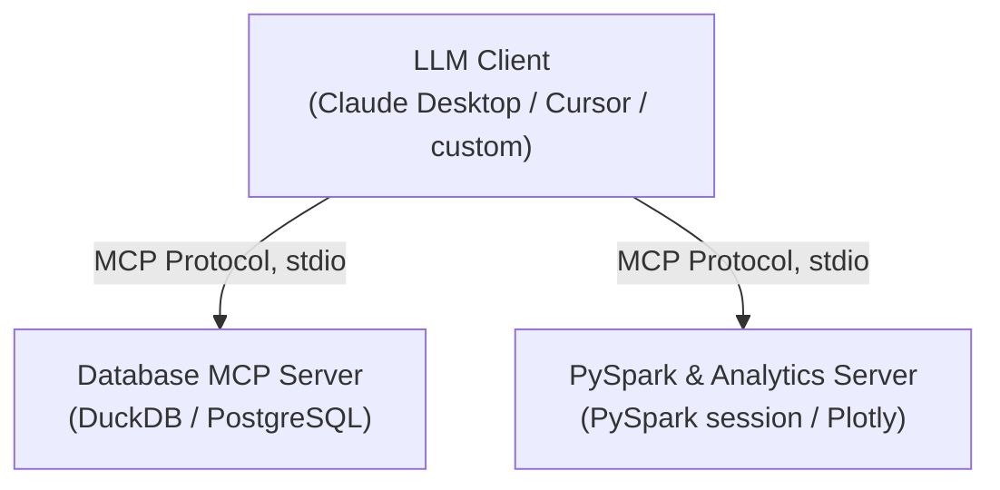
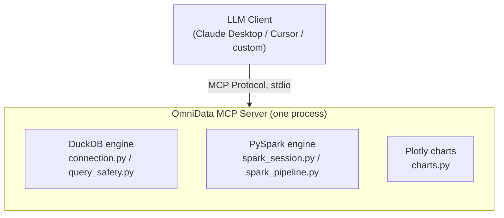

# OmniData MCP


**A unified Model Context Protocol server for intelligent data engineering & analytics.**

OmniData MCP lets LLM clients (Claude Desktop, Cursor, or any MCP-compatible
client) query, profile, transform, and visualize data using DuckDB and
PySpark, without raw data ever entering the model's context. Only
metadata, bounded query results, and summarized outputs are ever returned
to the LLM; every operation is logged locally for auditability.

## Registry & Certification

[](https://glama.ai/mcp/servers/MostafaAI10/OmniData-MCP)

*OmniData MCP is officially published and indexed on the [Glama MCP Registry](https://glama.ai/mcp/servers/MostafaAI10/OmniData-MCP), enabling seamless discovery and integration across supported LLM desktop environments.*

---

## Status: all planned phases complete

| Phase | Scope | Tools added |
|---|---|---|
| 0 | Project scaffolding, MCP server skeleton | `health_check` |
| 1 | DuckDB query/profiling engine | `list_datasets`, `get_schema`, `get_row_count`, `run_sql_query`, `get_data_profile` |
| 2 | Visualization | `generate_chart` |
| 3 | PySpark transformation engine | `execute_pyspark_job` |
| 4 | Hardening: audit logging, consistent error handling, docs | DONE |

See `CHANGELOG.md` for what changed in each phase, including two real
bugs found and fixed during development (an unhandled-exception error
path in Phase 4, and an unreliable Spark cancellation mechanism in
Phase 3) -- documented honestly rather than glossed over.

## Quick start

```bash
uv sync
cp .env.example .env
uv run python scripts/seed_sample_data.py   # creates sample sales/customers tables
uv run omnidata-db-server                    # sanity check: should hang silently (correct -- it's waiting on stdio)
```

### Connecting an MCP client

**Claude Desktop, packaged/MSIX installs (most current Windows installs):**
Raw `claude_desktop_config.json` editing does not work reliably on
this install type -- the file is app-managed and gets overwritten.
Use the included `manifest.json`:
Settings -> Extensions -> Advanced settings -> "Install Unpacked
Extension" -> select this project's root folder. Update
`manifest.json`'s `command`/`args` paths first if your `uv` install or
project location differ from the defaults.

**Claude Desktop (classic config), Cursor, or other MCP clients:**
Edit your client's MCP config directly:

```json
{
  "mcpServers": {
    "omnidata-db": {
      "command": "uv",
      "args": ["run", "--directory", "/absolute/path/to/omnidata-mcp", "omnidata-db-server"]
    }
  }
}
```

Either way, restart the client and ask it to call `health_check` to
confirm the connection.

## Architecture

The original design called for two separate MCP servers -- a lightweight Database server and a heavier PySpark & Analytics server -- communicating with the client independently:



**As built, this was deliberately consolidated into one server** (`db_server.py`, one process, one `manifest.json`, one Claude Desktop extension) rather than split in two:



Rationale: for a single-user local tool, one process means one install/uninstall cycle in Claude Desktop, one shared config and audit log, and no need to coordinate two lifecycles for what's still a small number of tools (8). The internal module boundaries (`connection.py`/`query_safety.py` for DuckDB, `spark_session.py`/`spark_pipeline.py` for Spark, `charts.py` for visualization) still mirror the original two-server split logically -- splitting back into separate processes later, if concurrency or multi-user needs justify it, would mean moving files, not rewriting them.

## Tool reference

| Tool | Purpose | Key args |
|---|---|---|
| `health_check` | Verify the server + DuckDB connection are alive; reports current guardrail config | -- |
| `list_datasets` | List tables/views available to query | -- |
| `get_schema` | Column names/types/nullability for one dataset | `dataset` |
| `get_row_count` | Exact row count for one dataset | `dataset` |
| `run_sql_query` | Bounded, read-only SQL (SELECT/WITH/EXPLAIN/DESCRIBE/SHOW only) | `sql`, `row_limit` |
| `get_data_profile` | Per-column stats (nulls, min/max, distinct count, quartiles) via DuckDB's `SUMMARIZE` | `dataset` |
| `generate_chart` | Bar/line/scatter chart from a query result -- saved to disk + returned inline | `sql`, `chart_type`, `x_column`, `y_column`, `series_column`, `title` |
| `execute_pyspark_job` | Declarative transformation pipeline (filter/select/withColumn/groupBy_agg/orderBy/distinct/limit) against a DuckDB table, run through Spark | `source_dataset`, `operations`, `row_limit` |

## Security & governance model

The pitch for this project was governance-first: an LLM should be able
to work with real data without raw rows ever landing in its context.
Every tool honors that in practice, not just in the tagline:

- **Read-only by construction, not by convention.** `run_sql_query`
  and `generate_chart` both validate every statement against an
  allowlist (`SELECT`/`WITH`/`EXPLAIN`/`DESCRIBE`/`SHOW` only,
  single-statement, no DDL/DML keywords anywhere in the text --
  including inside comments or subqueries). Verified against 14
  attack/edge cases during Phase 1 development.
- **No arbitrary code execution.** `execute_pyspark_job` takes a
  declarative JSON pipeline from a fixed set of operations, not raw
  Python or PySpark code to `exec()`. Every step is validated before
  it touches Spark.
- **Bounded by default.** Every query auto-injects a `LIMIT` when one
  isn't specified, and results are hard-capped regardless of what's
  requested (`max_row_limit`, `max_chart_rows`, `max_spark_input_rows`).
- **Timeouts on every long-running path**, since neither DuckDB nor
  PySpark has this built in: a thread + `connection.interrupt()` for
  DuckDB (confirmed via a genuinely slow query that got cancelled at
  ~10s and left the connection reusable afterward), a wall-clock timeout
  with best-effort cancellation for Spark (see the honest limitation
  noted below).
- **Local audit trail.** Every tool call is logged to `data/audit.log`
  as JSON lines -- tool name, argument summary, duration, outcome.
  Query/operation metadata only, never raw dataset rows, consistent
  with the "raw data stays local" principle -- and the log itself
  never leaves your machine either.
- **Consistent, structured errors.** Every tool returns the same
  `{"error": "..."}` shape on failure (enforced by the `@audited`
  decorator wrapping all 8 tools), rather than some failing cleanly
  and others surfacing raw unhandled exceptions.

## Design decisions

| Area | Decision |
|---|---|
| Package manager | `uv` |
| MCP framework | `mcp` SDK 2.0.0 (`MCPServer`, the successor to the earlier `FastMCP` class -- same decorator API) |
| Query safety | Statement allowlist (`SELECT`/`WITH`/`EXPLAIN`/`DESCRIBE`/`SHOW` only), single statement per call, query timeout |
| Sampling policy | Auto-inject `LIMIT` when absent; hard cap on rows returned per call; separate row-count tool |
| PySpark pipelines | Declarative op allowlist, not arbitrary code execution; no join operation exposed |
| PySpark session | Singleton `SparkSession`, `local[*]`, lazily initialized on first use, log level forced to `ERROR` to protect the stdio protocol |
| Chart rendering | Plotly + `kaleido==0.2.1` pinned (self-contained; `kaleido>=1.0` needs a separate Chrome install) |
| Chart delivery | Saved to disk as a real file *and* returned as an inline MCP image -- the file is the reliable path given client display limitations (see below) |
| Config | `pydantic-settings`, loaded from `.env` (see `.env.example`) |
| Audit logging | JSON lines to `data/audit.log`; metadata only, never raw rows |
| Error handling | Every tool returns `{"error": "..."}` on failure, enforced centrally |

## Project layout

```
omnidata-mcp/
|-- pyproject.toml
|-- manifest.json          # Claude Desktop unpacked-extension manifest
|-- LICENSE
|-- CHANGELOG.md
|-- .env.example
|-- scripts/
|   `-- seed_sample_data.py    # creates sample sales/customers tables
|-- src/omnidata_mcp/
|   |-- config.py              # centralized settings (pydantic-settings)
|   |-- connection.py          # DuckDB connection + timeout enforcement
|   |-- query_safety.py        # read-only SQL allowlist validator
|   |-- charts.py              # Plotly chart building
|   |-- spark_session.py       # lazy SparkSession + timeout handling
|   |-- spark_pipeline.py      # declarative pipeline op validator/executor
|   |-- audit.py               # @audited: logging + error normalization
|   `-- db_server.py           # the 8 MCP tools
`-- data/                       # local DuckDB file, charts/, audit.log (gitignored)
```

## Trying it out

Once `uv sync` and the seed script have run, ask your MCP client
things like:

- "What datasets are available?" -> `list_datasets`
- "What columns does the sales table have?" -> `get_schema`
- "Profile the sales table" -> `get_data_profile`
- "What's total revenue by product category?" -> `run_sql_query`
- "Chart total revenue by product category" -> `generate_chart` (bar)
- "Chart revenue over time by region as a line chart" -> `generate_chart`
  with `series_column` set to region
- "Use PySpark to compute average revenue per order, grouped by region,
  for orders over $50" -> `execute_pyspark_job` (filter + groupBy_agg)

`scripts/seed_sample_data.py` populates `data/omnidata.duckdb` with two
tables: `sales` (500 rows, deliberately includes a few NULLs and one
outlier -- useful for exercising `get_data_profile`) and `customers`
(50 rows, referenced by `sales.customer_id`). Re-run it any time to
reset to a clean sample dataset.

## Troubleshooting

**PySpark tools fail to start on Windows, mentioning `NativeIO$Windows`
or `UnsatisfiedLinkError`.** PySpark needs a JVM, and on Windows
specifically it also needs Hadoop's `winutils.exe` even in local mode
-- a well-known PySpark-on-Windows requirement unrelated to this
project.
1. Install **Java 17 or 21 (JDK)** from
   [Eclipse Temurin](https://adoptium.net/); set `JAVA_HOME` and add
   `%JAVA_HOME%\bin` to PATH.
2. Download **winutils.exe** matching your Spark/Hadoop version from a
   trusted mirror (e.g. [cdarlint/winutils](https://github.com/cdarlint/winutils)),
   place it at `<hadoop_home>\bin\winutils.exe`, `setx HADOOP_HOME
   "<hadoop_home>"`, add `%HADOOP_HOME%\bin` to PATH.
3. Open a **fresh terminal** after either change -- PATH updates via
   `setx` don't apply retroactively to already-open windows.

**Chart generation succeeds (per the tool result / audit log) but
nothing renders inline in the chat.** This is a known Claude Desktop
limitation, not a bug in this project: it does not currently render
inline images from locally-installed *unpacked* extensions (as opposed
to marketplace-published ones). Every chart is always saved to
`data/charts/<timestamp>_<id>.png` regardless -- the tool's response
text includes that file's full path; open it directly.

**Chart rendering fails demanding a Chrome install.** Something bumped
`kaleido` past 1.0. Re-pin it: `kaleido==0.2.1` in `pyproject.toml`,
then `uv sync`.

**`execute_pyspark_job` keeps timing out on legitimately large inputs.**
The timeout (`spark_job_timeout_seconds`, default 30s) has only
best-effort cancellation -- true in-JVM cancellation via Python threads
was tested during development and found unreliable in extreme cases (see
`CHANGELOG.md`, Phase 3). Try lowering `max_spark_input_rows` or adding
an earlier `filter`/`limit` step to your pipeline so there's less work
to do in the first place.

**Any tool install/sync step fails with "no space left on device" /
`WinError 112`, even though your project's own `.venv` is on a drive
with plenty of room.** Some Windows install paths can't be redirected
(Windows' native MSIX/AppX package installer always stages to
`C:\Program Files\WindowsApps`, and some tools' TEMP usage defaults
back to `C:\Users\<you>\AppData\Local\Temp` unless `TEMP`/`TMP` are
permanently redirected via `setx`). If you've hit this before,
re-check your `TEMP`/`TMP`/`UV_CACHE_DIR` environment variables are
still pointing where you expect, and separately confirm actual free
space on `C:` -- redirection isn't a substitute for real headroom on
installers that can't be redirected at all.

## License

This project is licensed under the **MIT License**.

---

## Author
 **MOSTAFA ABDELHAMED** | Junior AI & DS Researcher | NVIDIA Gen AI Certified
 [LinkedIn](https://www.linkedin.com/in/mostafa-abdelhamed-88a447286)
